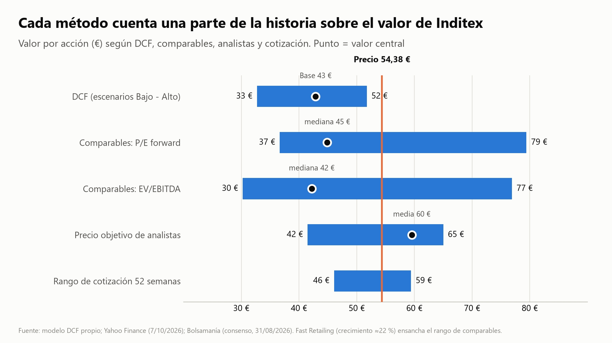
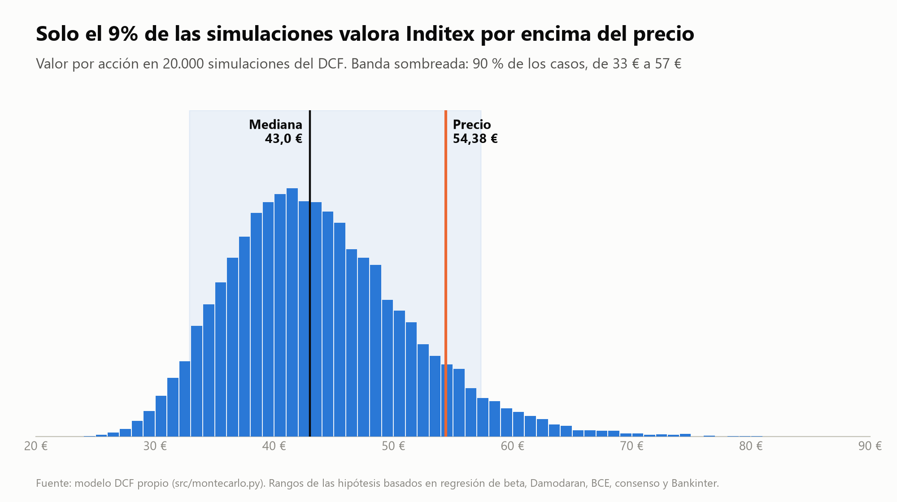

# Inditex: valuation and accounting quality

Corporate finance portfolio project by **Martín Peinado Miraflores** (Business Administration student, Universidad Complutense de Madrid).
🇪🇸 [Versión en español](README.es.md)

> **Educational project. Not investment advice.** All hypotheses are the author's own; third-party data is kept with its source and date. Figures are as of **7 October 2026**.

📄 **4-page report (PDF):** [English](informe/Inditex_Report_EN.pdf) · [Español](informe/Inditex_Informe_ES.pdf)

## What this project does

1. **Extracts** Inditex's consolidated annual accounts (fiscal years 2020-2025) from the official PDFs into a clean dataset, validated with accounting identities (balance sheet balances, EBITDA → EBIT → net income, cash flow reconciles with the balance sheet).
2. **Analyses ratios** (margins, ROIC/ROE, working capital, cash vs. dividends) in a Jupyter notebook.
3. **Values the company with a DCF** in Excel (live formulas, three scenarios, sensitivity table) and a **Python replica that matches the Excel to the cent**.
4. **Cross-checks the result** with peer multiples (H&M, Fast Retailing, Next), a **Monte Carlo** simulation (20,000 runs), and two accounting-quality screens: **Altman Z''** and **Beneish M-score**.

## Key results (share price: €54.38)

| Method | Value per share |
|---|---|
| DCF, scenarios Low / **Base** / High | €32.73 / **€42.87** / €51.75 |
| Peer multiples, median (P/E forward · EV/EBITDA) | €44.9 · €42.2 |
| Monte Carlo: median, and 90 % of the runs | €43.0, between €32.9 and €57.3 |
| Probability that the value exceeds the price | **8.9 %** |
| Analysts' consensus target (24 analysts) | €59.54 (range €41.50-65.00) |
| Altman Z'' 2020-2025 (safe zone: above 2.6) | 4.6 to 6.0 |
| Beneish M 2021-2025 (alert: above −1.78) | −2.74 to −2.95 (−2.49 to −2.70 adjusted for IFRS 16) |

**Takeaway.** With the base-case cash flows, today's price implies a cost of capital of about **7.5 %**, versus the **8.97 %** used here. Most of the gap with analysts' targets is the **discount rate**, not the operating forecasts: with the analysts' consensus sales and margins but this model's cost of capital, the value is about €47.8. No red flags in the accounting-quality screens (which are screening tools, not proof).





## Method in brief

- **Cost of capital 8.97 %:** risk-free 3.57 % (10-year Bund) + beta 1.0 (own regression, 0.95-1.08 depending on index) × equity risk premium 5.4 % (Damodaran mature-market 4.17 % plus country risk weighted by Inditex's sales mix, **author's estimate**). Perpetual growth 2.5 %.
- **Leases (IFRS 16):** rent is treated as an operating cost in the free cash flow, so lease liabilities are *not* deducted again in the equity bridge.
- **Valuation date** 31 July 2026 (latest published balance sheet, H1 2026), rolled forward to the price date. Mid-period discounting, 10-year explicit forecast plus Gordon terminal value (about 58 % of enterprise value).
- **Scenarios** for sales growth, EBIT margin and capex are contrasted with company guidance, analysts' consensus and broker research.

A step-by-step explanation of every data point and every cell of the Excel model (in Spanish) is in [`docs/Guia_del_modelo.md`](docs/Guia_del_modelo.md).

## Repository structure

```
excel/Inditex_Valoracion.xlsx      Valuation model: Summary, Assumptions, Historical, DCF, Sensitivity, Comparables
notebooks/01_analisis_ratios.ipynb Ratio analysis with charts
src/
  extract_statements.py            PDF -> raw statements table
  build_dataset.py                 Normalise items and validate accounting identities
  dcf_model.py                     DCF in Python (checks the Excel; reused by Monte Carlo)
  beta.py                          Beta regression vs. European indices (Yahoo Finance data)
  hipotesis_analisis.py            Tornado chart, cost-of-capital packages, reverse DCF
  comparables.py                   Peer-multiple valuation and football-field chart
  montecarlo.py                    20,000-run Monte Carlo on the DCF
  calidad_contable.py              Altman Z'' and Beneish M-score
  build_excel.py                   Builds the Excel workbook with formulas
  limpiar_metadatos_excel.py       Strips machine-specific metadata from the .xlsx
  report_charts.py                 Report charts in Spanish and English
  build_report.py                  Builds the PDF reports (HTML template + Microsoft Edge headless)
data/market/                       Market data and peer multiples, each with source and date
data/processed/                    Clean datasets and model outputs
informe/                           PDF reports (EN/ES) and charts (graficos/, report_assets/)
docs/Guia_del_modelo.md            Full guide to the model (Spanish)
```

## Reproduce

Requires Python 3.12.

```bash
python -m venv .venv
.venv\Scripts\pip install -r requirements.txt
```

1. Download Inditex's consolidated annual accounts (FY2021-FY2025) from the [investor relations page](https://www.inditex.com/itxcomweb/ad/es/inversores/informacion-financiera) and save them in `data/raw/` as `CCAA_consolidadas_FY2021.pdf` … `CCAA_consolidadas_FY2025.pdf`. (The PDFs are not stored in this repository.)
2. Run the pipeline from the project root:

```bash
python src/extract_statements.py
python src/build_dataset.py
python src/dcf_model.py
python src/comparables.py
python src/montecarlo.py
python src/calidad_contable.py
python src/report_charts.py
python src/build_report.py      # needs Microsoft Edge; writes the two PDFs to informe/
```

`src/beta.py` and `src/hipotesis_analisis.py` need an internet connection (Yahoo Finance). Excel recalculates the workbook when opened; `src/build_excel.py` regenerates it from Python.

## Data sources and limitations

- **Sources:** Inditex consolidated annual accounts and results (inditex.com); Yahoo Finance and Investing.com (prices, multiples, betas); datosmacro (government bond yields); Damodaran (equity risk premia, sector betas); ECB projections; Bolsamanía and Bankinter (consensus and research). Every data point in `data/market/` carries its source and date.
- **Limitations:** the first half of fiscal 2026 is valued as half of the annual flow (ignores seasonality); only three peers, with different fiscal calendars (not calendarised); consensus labels were interpreted as fiscal years ending in January; the Monte Carlo probabilities depend on the ranges chosen for each hypothesis; Altman and Beneish were designed on other companies and eras.

## Author and license

Martín Peinado Miraflores, Business Administration, Universidad Complutense de Madrid.
Released under the [MIT License](LICENSE). Third-party data remains subject to its original sources' terms.
